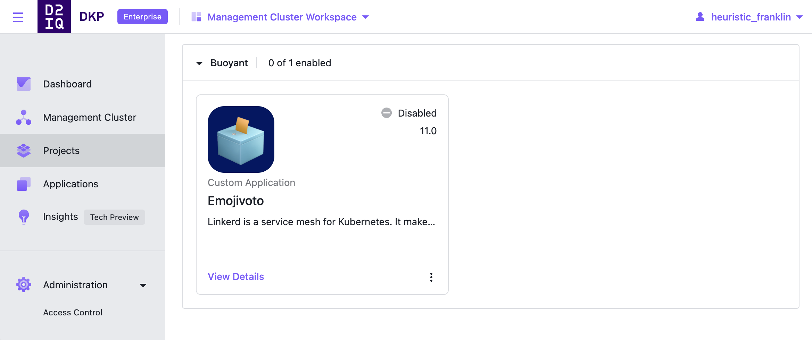

# emojivoto-catalog
## This is a custom catalog for Emojivoto for Kommander




To add the Emojivoto catalog to DKP, you will first need to make the project namespace in the DKP UI. Once you have the project created run the following but replace `emojivoto` with your project namespace:

```
export PROJECT_NAMESPACE=emojivoto
```

```
kubectl apply -f - <<EOF
apiVersion: source.toolkit.fluxcd.io/v1beta1
kind: GitRepository
metadata:
  name: emojivoto-catalog-repo
  namespace: ${PROJECT_NAMESPACE}
  labels:
    kommander.d2iq.io/gitapps-gitrepository-type: catalog
    kommander.d2iq.io/gitrepository-type: catalog
spec:
  interval: 1m0s
  ref:
    branch: main
  timeout: 20s
  url: https://github.com/phenderson-d2iq/emojivoto-catalog
EOF
``` 